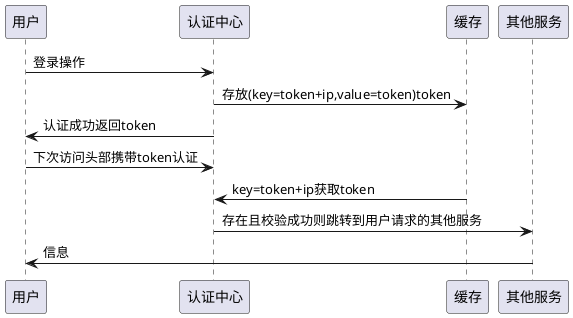

# 幻灯片测试 第八页

## 背景视频

可以插入一个背景视频

```plantuml
@startuml
用户 -> 认证中心: 登录操作
认证中心 -> 缓存: 存放(key=token+ip,value=token)token

用户 <- 认证中心 : 认证成功返回token
用户 -> 认证中心: 下次访问头部携带token认证
认证中心 <- 缓存: key=token+ip获取token
其他服务 <- 认证中心: 存在且校验成功则跳转到用户请求的其他服务
其他服务 -> 用户: 信息
@enduml

```